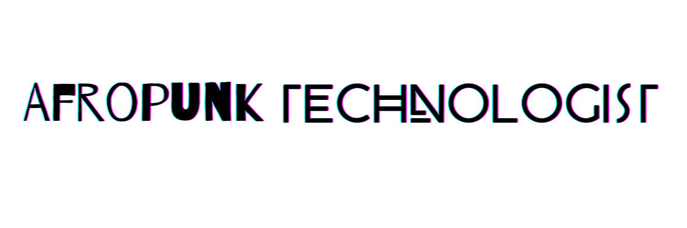

<h1 style="font-family: 'Lora'">Hi, I'm Quinten.</h1>

<strong>I'm an Afrofuturist interested in Biotechnology, Bioinformatics and Computational Biology.</strong>

I'm building tools to program living cells enabling the intelligent design of living systems to power 
biotechnologies with outsized societal benefit.

<h2 class="heading-section" style="font-family: 'Poppins; font-size: 14vw; font-weight:900'"><strong>Latest &</strong> Greatest</h2>

Currently, I'm working on cross-platform CAD tools for building therapeutic applications. 

Currently, I'm learning ARM Assembly, R & Verilog  

Pronouns: Real/Nigga

Languages & Tools: ARM Assembly, Bash, C#, C++, C, GraphQL, HTML/(S)CSS, JavaScript,
MATLAB, PowerShell, Python, R, SQL, Swift, Verilog/Systems Verilog, Visual Basic .NET

